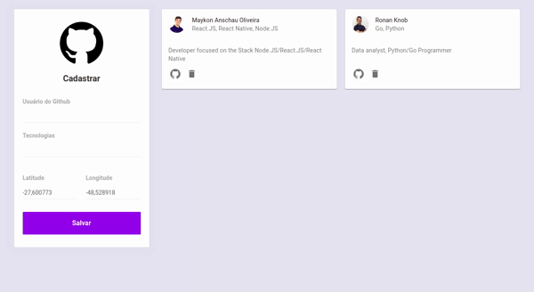
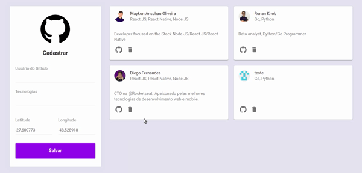
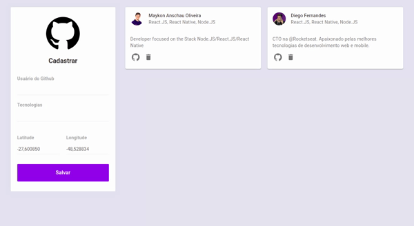

<h1 align="center">
    
     
    Developer Maps
</h1>

  

  

  

  

  

  

# Screens

## Add developer

## Delete developer

## Github acess

# Prerequisites

- Node
- Yarn

# Run the project

To run this project you need execute the following steps:

1. Clone the repository: `git clone git@github.com:MaykonOliveira/developer-maps-frontend.git`

2. Enter in the directory of the project: `cd developer-maps-frontend`

3. Install the dependencies: `yarn`

4. Execute the project: `yarn start`

# Observations

* The backend used in the examples of this project is hosted on Heroku, so there may be lag in the gifs because of that.

* To run the joint project on the backend you can find it here, you just need to create a configuration file (.env) in this project with a variable called `REACT_APP_API_URL` containing the URL for accessing the backend, usually` localhost: 3333`

# What are the next steps?

- [ ] Adjust the layout to use Material-UI to be more responsive.
- [ ] Create a update function to the Dev cards.
- [ ] Create a Login interface with access levels.

## License

MIT

See the [License](LICENSE.md) file.
